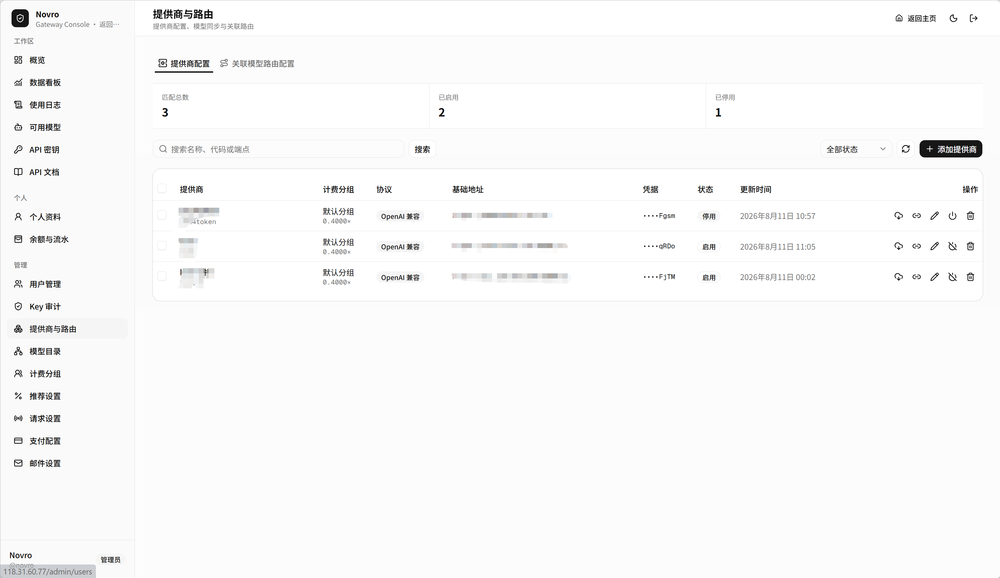
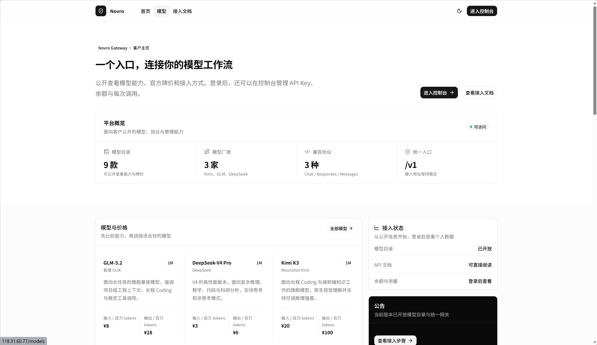
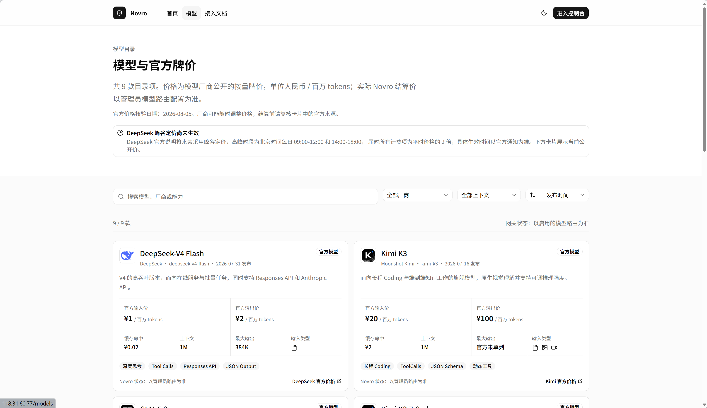
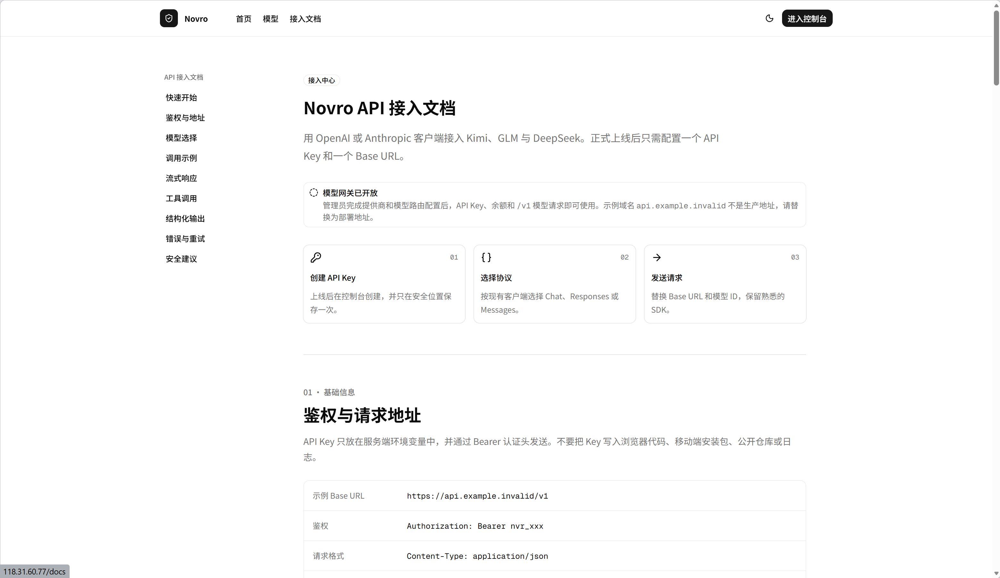

# Novro

Novro 是一个面向企业团队的大模型统一接入平台。它用一个 API 地址和一套
API Key 对接 Kimi、GLM、DeepSeek 等模型，同时提供账号、余额、API Key、
模型路由和调用用量管理。

- 开发人：gaohongshun
- 许可证：AGPL-3.0
- 后端：Go、Ent、MySQL
- 前端：Next.js、TypeScript、shadcn/ui

## 界面预览

| 控制台 | 首页 |
| --- | --- |
|  |  |

| 模型目录 | API 文档 |
| --- | --- |
|  |  |

## 项目定位

Novro 不是复杂的模型运营平台，而是一个轻量、可部署、边界清晰的模型网关和
管理控制台。当前版本聚焦在企业内部模型 API 管理的核心闭环：

- 统一 OpenAI / Anthropic 风格的模型调用入口。
- 管理企业成员、管理员、登录会话和账号状态。
- 为用户创建、展示、撤销 API Key，并只保存密钥哈希和必要前缀。
- 按用户维护余额、流水、充值订单和模型调用用量。
- 管理模型提供商、模型目录、计费分组和路由配置。
- 支持按提供商权重选择模型路由、响应前重试与故障切换，以及按 usage 结算。
- 提供桌面侧边栏、移动端导航抽屉、浅色和深色主题。

## 多提供商路由流程

同一个计费分组和对外模型可以配置多个提供商。权重越高的提供商越优先；
权重相同时保持稳定的路由顺序。单个提供商最多请求三次，仍然失败后才切换
到下一个提供商：

```text
客户端 API Key
    ↓ 鉴权
取得 API Key 对应的 billing_group_id
    ↓
使用 billing_group_id + public model 查询可用模型路由
    ↓
过滤：路由启用、提供商启用、目录模型启用且已定价、协议兼容
    ↓
按照提供商 weight 从高到低排序
    ↓
请求权重最高的提供商
    ├─ 第 1 次成功：直接返回，不请求其他提供商
    ├─ 第 1 次失败：重试第 1 次
    ├─ 第 2 次失败：重试第 2 次
    └─ 第 3 次仍失败：切换到下一个权重的提供商
                           ↓
                    重复相同的三次尝试
                           ↓
                    全部提供商失败
                           ↓
                退还预占余额并返回失败
```

## 技术栈

- Go 服务：`cmd/novro`
- 私有应用代码：`internal`
- 数据模型：Ent schema 和生成代码
- 数据库：MySQL 8.4
- 迁移：`ent/migrate/migrations`
- Web 控制台：Next.js App Router
- UI 基础：原始 shadcn/ui primitives
- 包管理：pnpm workspace

## 目录结构

```text
cmd/novro                 Go 服务入口
internal                  后端应用、领域和基础设施代码
ent                       Ent schema 与生成的数据访问代码
ent/migrate/migrations    有序 SQL 迁移
apps/web                  Next.js 控制台
docs                      产品、开发、API、部署和运维文档
docs/images               README 截图资源
```

## 本地启动

前置条件：

- Go `1.26.5`
- Node.js `24`
- pnpm `10.30.3`
- MySQL `8.4`

安装依赖：

```powershell
pnpm install
go mod download
```

复制 `.env.example` 中的变量名到本地安全环境。不要提交真实 `.env`、
数据库密码、API Key、会话密钥、私钥或生产连接串。

初始化并迁移数据库：

```powershell
go run ./cmd/novro init-db
go run ./cmd/novro check-db
go run ./cmd/novro migrate
```

启动后端和控制台：

```powershell
go run ./cmd/novro
pnpm --dir apps/web dev
```

默认入口：

- 控制台：`http://localhost:3000`
- API 接入文档：`http://localhost:3000/docs`
- 模型与官方价格：`http://localhost:3000/models`
- 存活检查：`http://localhost:8080/healthz`
- 就绪检查：`http://localhost:8080/readyz`

## 初始化管理员

推荐通过一次性初始化令牌创建第一个管理员：

```powershell
$env:NOVRO_SETUP_TOKEN='<GENERATED_RANDOM_VALUE>'
go run ./cmd/novro
```

然后访问 `http://localhost:3000/setup` 完成初始化。成功后从部署环境移除
`NOVRO_SETUP_TOKEN`。

无浏览器环境可以使用命令行初始化：

```powershell
$env:NOVRO_BOOTSTRAP_USERNAME='novro'
$env:NOVRO_BOOTSTRAP_EMAIL='novro@example.invalid'
$env:NOVRO_BOOTSTRAP_DISPLAY_NAME='Novro'
$env:NOVRO_BOOTSTRAP_PASSWORD='<SET_A_RANDOM_PASSWORD>'
go run ./cmd/novro bootstrap-admin
Remove-Item Env:NOVRO_BOOTSTRAP_PASSWORD
```

## 配置与安全

- 运行配置来自环境变量。
- 前端服务端变量使用 `NOVRO_SERVER_URL`，不要使用 `NEXT_PUBLIC_*` 暴露服务端配置。
- 正常运行不要使用 MySQL 管理员账号，使用最小权限应用账号。
- 生产环境数据库 TLS 必须保持启用。
- 不要在 HTTP 响应、前端页面、日志或文档里暴露密码、密钥、连接串、Cookie 或 Authorization 头。
- 不要让服务启动时自动创建 Ent schema，数据库变更必须通过显式迁移。

## 开发校验

窄范围修改后运行对应检查，交付前运行完整检查：

```powershell
go test ./cmd/... ./internal/... ./ent/...
go vet ./...
pnpm --dir apps/web lint
pnpm --dir apps/web typecheck
pnpm --dir apps/web test
pnpm --dir apps/web build
```

Windows 没有 `make` 时直接运行上面的命令。有 `make` 时也可以执行：

```powershell
make check
```

## 文档

- [产品概述](docs/product-overview.md)
- [开发启动说明](docs/getting-started.md)
- [环境变量说明](docs/environment.md)
- [API 文档](docs/api.md)
- [管理控制台](docs/admin-console.md)
- [生产部署手册](docs/docker-deployment.md)
- [工程说明](docs/engineering.md)

## 许可证

Copyright (C) 2026 gaohongshun.

Novro 使用 GNU Affero General Public License v3.0 授权。完整条款见
[LICENSE](LICENSE)。
