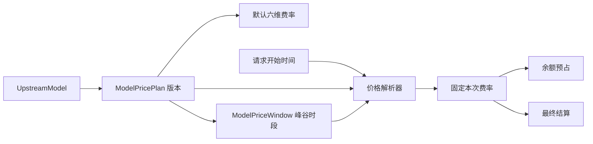

# 数据模型

## 1. 关系概览

```text
User
├── UserSession[]
├── UserIdentity[]
├── APIKey[]
├── Wallet
├── TopUpOrder[]
└── APIUsage[]

APIKey
├── BillingGroup
└── GatewayOperation[]

Provider
└── ModelRoute[]

BillingGroup
└── APIKey[] / ModelRoute[] / APIUsage[]

UpstreamModel
├── ModelRoute[]
├── ModelPricePlan[]
└── APIUsage[]

ModelPricePlan
└── ModelPriceWindow[]

Wallet
└── WalletEntry[]

PaymentConfig
└── administrator-managed payment provider settings

EmailVerificationCode
└── standalone pre-registration email challenge
```

当前认证范围不增加组织、项目和项目成员关系。

## 2. users

建议字段：

- `id`
- `invite_code`，创建时生成的唯一邀请码，之后不可修改
- `referred_by_user_id`，可空且创建后不可修改，指向邀请人
- `username`，唯一
- `email`，规范化为小写且唯一；新本地账号和 OIDC 自动创建账号必须提供，历史账号迁移时可空
- `display_name`
- `password_hash`，可空；仅使用 OIDC 的账号不保存本地密码
- `role`，`admin` 或 `member`
- `status`，`active` 或 `disabled`
- `last_login_at`
- `created_at`
- `updated_at`

约束：系统至少保留一个启用状态的管理员，不能通过角色降级或状态变更移除最后一个
启用的管理员。该约束由服务端在数据库事务内执行。

## 3. user_sessions

建议字段：

- `id`
- `user_id`
- `token_hash`
- `expires_at`
- `revoked_at`
- `created_at`
- `last_seen_at`

服务端只保存会话 Token 哈希，不保存浏览器可直接使用的明文会话 Token。

## 4. user_identities

- `id`
- `user_id`
- `issuer`
- `subject`
- `email`，仅作为身份元数据
- `created_at`
- `updated_at`

`issuer + subject` 唯一确定一个外部身份，`user_id + issuer` 也具有唯一约束。身份表邮箱
保留上游声明，OIDC 自动创建用户时还会写入规范化后的 `users.email`。系统不按邮箱自动
合并本地账号，OIDC access token、ID Token 和 Client Secret 不写入该表。

## 5. system_settings

保存 `initial_admin_created` 安装标记和不含秘密的应用设置。`referral_reward_bps` 记录管理员
设置的全局邀请返现基点；`gateway_request_settings` 以 JSON 原子保存 SSE 心跳开关、心跳间隔、
上游总超时、流式空闲超时，以及输入/输出预占 Token 上限。旧 JSON 缺少预占上限时分别补
默认值 16384 和 1024。`system_announcement` 以 JSON 保存单个纯文本公告的标题、正文和启用
状态；未启用的草稿只对管理员返回。为容纳公告正文，`value` 使用 `TEXT`，应用服务仍按每种
设置单独限制内容长度。该表不保存初始化令牌、密码、连接信息或其他部署密钥。初始化标记
与第一个管理员在同一数据库事务中创建，保证初始化只能完成一次。

## 6. 当前迁移状态

当前迁移从 `0001_initial_schema.sql` 开始，并通过后续有序迁移演进。`0009_gateway_billing_safety.sql`
新增持久化网关 operation 和计费补偿流水类型；`0010_billing_group_user_authorizations.sql` 新增隐藏
计费分组与普通成员的多对多授权表；`0011_system_announcement.sql` 将全局设置值扩为 `TEXT`；
`0012_model_price_plans.sql` 新增版本化固定价和分时价方案，并把已有目录价格回填为版本 1；
`0013_model_route_billing_groups.sql` 将旧提供商分组关联迁移到模型路由；`0016_billing_group_compositions.sql`
为计费分组增加 `kind` 并创建主分组成员关系。部署包含主分组功能的代码前必须先成功执行到 `0016`。
迁移创建认证、用户、API Key、供应商、模型目录、模型路由、计费分组、钱包、充值、
邮件、邀请返现、系统公告、用量审计和结算恢复相关表，并写入默认计费分组与默认邀请返现比例。
服务启动不修改数据库结构；部署和本地升级都必须显式运行 `migrate`。旧库升级不再作为
当前迁移文件的目标，保留数据升级时需要使用对应历史版本先完成迁移。

提供商、模型目录、模型路由和计费分组使用软删除。普通查询和网关路由解析排除
`deleted_at` 非空记录，但历史用量、钱包流水及外键关联继续保留。删除提供商或目录模型时，
关联模型路由在同一事务中一并软删除；默认计费分组以及仍被启用 API Key 或未删除模型路由
使用的分组拒绝删除。

## 7. wallets

每个用户一个钱包，建议字段：

- `id`
- `user_id`，唯一
- `balance_micros`，定点整数，1 元人民币等于 1,000,000 微元；结算极端超出预占时允许短暂负数，等待管理员补充余额
- `created_at`
- `updated_at`

余额使用定点数类型，避免使用浮点数。钱包余额和流水变更需要在同一事务中完成。

## 8. wallet_entries

建议字段：

- `id`
- `wallet_id`
- `amount_micros`
- `balance_after_micros`
- `entry_type`，`manual_adjustment`、`top_up`、`referral_reward`、`usage_reservation`、`usage_refund`、`usage_settlement` 或 `usage_compensation`
- `reference_id`
- `description`
- `actor_user_id`，人工调整时记录管理员
- `created_at`

余额能力保留流水表，方便审计、人工调整和调用结算。

调用开始时先写入负的 `usage_reservation`，成功后写入释放差额的 `usage_refund`；两者的
净变化就是最终调用费用。钱包行使用 `SELECT ... FOR UPDATE` 语义锁定。同一钱包的
`reference_id + entry_type` 唯一，使余额预占和退款可以安全重试；相同金额的重复请求
视为已完成，不同金额的重复请求视为冲突。若真实 usage 超过预占，会追加一条
`usage_settlement` 补扣流水，不能静默截断费用。

`usage_compensation` 只用于经核对的旧版 `token-v2`、成功状态、`estimated=true` 异常用量。
它使用原调用 `request_id` 作为引用并全额冲回该记录费用；同一钱包、请求和流水类型的唯一约束
确保并发或重复执行只补偿一次。生产补偿必须基于审核后的 request ID 清单执行，不能按模糊条件
直接批量修改余额。

`referral_reward` 使用被邀请用户的充值订单 ID 作为 `reference_id`。同一钱包、订单和流水
类型的唯一约束保证重复支付回调只能写入一次返现；返现与充值入账在同一事务内提交。

## 9. top_up_orders

每次在线充值创建一个订单，建议字段：

- `id`
- `user_id`
- `out_trade_no`，Novro 商户订单号，全局唯一
- `provider`，当前为 `epay`
- `channel`，支付网关渠道代码
- `amount_micros`，精确到分的正整数人民币微元
- `credited_micros`，支付成功后实际增加的钱包余额，包含适用的充值赠送
- `status`，`pending` 或 `paid`
- `provider_trade_no`，支付平台订单号，支付成功后唯一
- `paid_at`
- `created_at`
- `updated_at`

异步通知先锁定订单，再用 `amount_micros` 核对支付金额和渠道并锁定用户钱包；钱包使用
`credited_micros` 入账。订单状态、钱包余额和引用订单 ID 的 `top_up` 流水在同一事务内提交。
重复成功通知读取到 `paid` 后直接确认，不重复增加余额。

## 10. payment_configs

支付配置以 `provider=epay` 的单行记录保存，包含启用状态、接口地址、商户 ID、站点名称、
结构化支付方式、全局金额范围、预设金额和赠送档位。`channels` 继续作为旧配置兼容字段；
新请求从启用的支付方式推导渠道。商户密钥字段只保存使用
`NOVRO_PROVIDER_ENCRYPTION_SECRET` 加密的密文；管理员读取接口只返回
`has_merchant_key`，不会返回密钥。回调和返回地址由 `NOVRO_PUBLIC_URL` 生成，不作为可编辑
凭据保存。用户充值服务按请求读取这条记录，因此管理员保存后无需重启即可影响充值弹窗。

## 11. api_keys

建议字段：

- `id`
- `user_id`
- `billing_group_id`，Key 绑定的计费分组
- `name`
- `key_prefix`
- `key_hash`
- `status`，`active` 或 `revoked`
- `last_used_at`
- `created_at`
- `revoked_at`

完整 Key 只在创建成功时显示一次。数据库只保存哈希和前缀。Key 前缀用于用户识别自己的 Key，但不能用于认证。
认证时会同时校验用户、Key 和 Key 所属计费分组均启用；停用分组后，该组 Key 不再通过网关认证。

## 11. providers

- `id`、`code`、`display_name`
- `protocols`，JSON 数组，至少包含 `openai` 或 `anthropic` 中的一项，可同时包含两项
- `protocol`，兼容字段，保存模型目录同步使用的主协议；双协议提供商固定为 `openai`
- `base_url`
- `model_list_path`，可选的模型获取路径覆盖值
- `weight`，1 到 1000000 的请求优先级，默认 100，数值越大越优先
- `encrypted_api_key`，AES-256-GCM 密文，仅服务端读取
- `api_key_hint`，只用于显示末尾提示
- `status`、`created_at`、`updated_at`

`model_list_path` 保存可选的模型获取路径；空值保留协议默认路径，非空值必须是以 `/` 开头的
站点绝对路径，并在模型目录同步时覆盖默认拼接规则。基础地址允许 HTTP 或 HTTPS，以支持自建和第三方网关；生产环境建议使用 HTTPS，避免 API Key
明文传输。网关默认拒绝解析到回环、私有、链路本地、未指定或组播地址的上游目标，并禁止跟随
上游重定向。
网关按请求入口检查 `protocols`：Chat Completions 与 Responses 使用 OpenAI，Messages 使用
Anthropic。协议之间不做请求或响应转换。同一提供商的所有模型路由继承这组协议能力。
供应商不再直接关联计费分组；一个供应商可以通过多条模型路由为多个分组提供同一模型。
网关解析候选路由时，普通 Key 按自身 `billing_group_id` 过滤，主分组 Key 按启用成员集合过滤，再按提供商
`weight` 降序请求；同权重保留稳定路由顺序。

## 12. model_routes

- `provider_id`
- `upstream_model_id`，指向独立模型目录记录
- `billing_group_id`，该路由所属的计费分组
- `public_name`，对外模型名，创建后不可修改；自动关联时使用全局目录模型 ID，多个提供商因此进入同一个故障切换池
- `display_name`
- 旧版 `upstream_name`、输入/输出价格字段保留用于迁移兼容，新的计费读取全局模型目录
- `status`、`created_at`、`updated_at`

`billing_group_id + public_name + provider_id + upstream_model_id` 组合唯一，防止同一分组中完全相同的渠道重复配置。同一
`public_name` 下只有模型路由、提供商配置、所属分组和目录模型都启用，且路由分组属于当前 API Key 的普通分组
或主分组成员集合的记录才进入候选池；
`/v1/models` 对同名候选去重后返回。

## 13. billing_groups

- `code`、`display_name`、`kind`（`standard` 或 `composite`）
- `multiplier_bps`，10000 表示 1.0000 倍
- `discount_name`、`discount_multiplier_bps`、`discount_starts_at`、`discount_ends_at`，保存一个定时优惠窗口
- `is_default`、`status`、`created_at`、`updated_at`

计费分组用于 API Key 和模型路由两个维度。`standard` 分组可配置倍率、定时优惠和模型路由；`composite`
主分组只绑定 API Key 和成员，不配置自身倍率、优惠或路由。`billing_group_compositions` 使用
`composite_group_id + member_group_id` 唯一保存显式成员；成员只能是普通分组，不能嵌套主分组。一个普通分组
可以复用于多个主分组。`is_hidden` 标记分组是否只对管理员和该分组已授权用户可见。
`billing_group_authorized_users` 用 `(billing_group_id, user_id)` 唯一记录普通成员的逐组授权；管理员
自动拥有全部隐藏组权限，不写入该表。`0010` 会将旧 `can_access_hidden_groups = TRUE` 的普通成员
回填到迁移时所有未删除隐藏组，以保持升级前的有效权限；应用不再读取或写入旧布尔列。创建 API Key
时用户选择分组；主分组 Key 的路由候选为所有启用成员的路由，同一公开模型跨成员合并，最终命中成员决定倍率。
管理员在模型关联和模型路由配置时只能选择普通分组。请求开始时间命中优惠半开区间 `[discount_starts_at, discount_ends_at)` 时，实际倍率为 `multiplier_bps × discount_multiplier_bps / 10000`，否则使用基础倍率；分组倍率和优惠规则由进程级共享快照提供，首次使用可由 API Key 认证结果填充，管理服务写操作成功后同步更新或移除缓存项。最终倍率随用量快照保存，倍率数值不参与路由匹配。撤销某一隐藏组授权后，该用户绑定该组的现有 API Key 立即停止认证，但其他分组授权不受影响。默认分组
用于空库初始化和默认选择，不能停用。

## 14. upstream_models

- `provider_name`，普通厂商标签，不绑定提供商凭据配置，也不决定价格归属
- `upstream_name`，全局唯一的精确模型 ID；`display_name` 为管理界面显示名称
- 旧版六个价格字段和 `pricing_configured` 暂时保留，用于无价格版本的兼容回退和滚动升级
- `status`、`created_at`、`updated_at`

同一模型 ID 无论被多少提供商暴露都只维护一组 Novro 自定义价格版本。同步只发现精确 ID，
不读取或导入上游返回的 `pricing` 字段；管理员必须在目录价格方案入口维护并发布价格。未知模型
默认停用且不能在未完成定价时启用，避免把未知成本按零价格结算。自动关联路由的对外名称
与精确上游 ID 一致，历史的提供商前缀和数字后缀由后续迁移修复。

初始化迁移不再内置官方模型目录。管理员通过供应商同步发现模型后，在模型目录发布价格并启用。
固定价和按星期、时段重复的分时价已经支持；按输入/输出长度分档的阶梯计价仍不在当前规则范围内，
这类模型在支持阶梯价格前应保持待定价状态。

## 15. model_price_plans 和 model_price_windows

`model_price_plans` 是模型价格的版本化来源：



- `upstream_model_id + version` 唯一，`mode` 为 `fixed` 或 `scheduled`
- 固定价使用 `timezone=UTC`，只保存默认六维费率
- 分时价的 `timezone` 使用 IANA 时区名；两种模式都在发布时由服务端写入 `effective_from`
- `effective_to` 只记录该版本被新版本替换或历史版本切换的时间，不接受管理员排期
- `status` 为 `draft`、`published` 或 `retired`
- 默认费率包含普通输入、输出、缓存命中、两种缓存创建和按次固定费六个维度

`fixed` 方案只包含默认六维费率。`scheduled` 方案必须有一个或多个 `model_price_windows`。窗口用 `weekday_mask`、
`start_minute` 和 `end_minute` 表示不跨日的周重复时段，并保存完整六维费率；未命中窗口时使用
方案默认费率。同一星期内窗口不能重叠，结束分钟不属于当前窗口。管理员只能修改或删除草稿；
发布任一模式的新版本时，服务会以事务内的发布时间立即启用新版本并关闭当前版本，不存在未来生效空档。
历史版本切换直接调整已有版本的审计区间：目标版本从当前时间开始生效，当前版本在该时刻失效，
版本号和完整价格定义保持不变，因此不会生成新版本。若目标版本已经是当前生效版本，切换操作幂等完成。

网关在请求开始时选择当前已发布版本，再按方案时区解析窗口，并把结果固定到本次预占和最终结算。请求执行期间即使
跨过时段边界或管理员发布新版本，也不会改变本次调用价格。只有模型完全没有已发布版本时才允许
读取旧版价格字段；已有已发布版本但当前处于生效空档时返回无有效价格，不静默回退。
网关服务会将每个模型的已发布方案和窗口作为共享内存快照复用，首次访问该模型时加载一次；发布新版本
后主动淘汰旧快照，下一次请求重新加载，因此高并发请求不会逐个查询价格表，时间边界仍按请求开始时间计算。

## 16. api_usages

- `user_id`、`api_key_id`、`model_route_id`
- `request_id`、`endpoint`
- `status_code`、`error_code`、`error_message`、`duration_ms`
- `input_tokens`、`uncached_input_tokens`、`cache_read_input_tokens`、`cache_write_input_tokens`、
  `cache_write_1h_input_tokens`、`output_tokens`
- 当时采用的各类价格、`base_cost_micros`、`multiplier_bps`、计费分组和算法版本
- `reserved_micros`、`cost_micros`、`estimated`
- `upstream_request_id`、`created_at`、`finished_at`

网关按各维度 `token × 单价` 汇总原始分子，乘实际命中普通成员的倍率后只向上取整一次；所有候选上游均失败的请求也会写入
该表，但费用和 Token 保持为 0，并通过状态码和错误字段标记失败。该表保存调用审计和不可变结算依据，
不保存请求提示词、完整响应或上游凭据。`token-v3-confirmed-usage` 算法只结算上游明确报告的
Token 维度；缺失维度保持 0 并设置 `estimated`，保守请求预占只用于余额校验，不能作为最终费用。
预占取全部候选渠道在各自成员倍率下的最高估算金额；最终费用、计费分组和倍率均使用实际命中路由的普通成员，
并把请求开始时固定的优惠结果保存为 `multiplier_bps` 快照。

## 17. gateway_operations

- `id`，也是对外 `request_id`
- `user_id`、`api_key_id`
- `idempotency_key_hash`，只保存客户端幂等键的 SHA-256，不保存原值
- `request_hash`，绑定 endpoint 与原始请求体
- `endpoint`
- `status`，`processing`、`pending_settlement`、`pending_unknown`、`completed` 或 `failed`
- `reserved_micros`
- `settlement_json`，完整且可验证的最终 `UsageInput` 快照
- `failure_code`、`created_at`、`updated_at`

`api_key_id + idempotency_key_hash` 唯一。operation 创建、钱包行锁、预占扣减和
`usage_reservation` 流水在同一事务中完成，因此同键并发请求只能有一个创建者。相同键和相同
请求读取已有 operation，不再次调用上游；相同键绑定不同请求时返回冲突。

成功终态先把不可变 usage 快照写为 `pending_settlement`，再在钱包事务中验证 operation、用户、
API Key、endpoint、预占金额和对应预占流水，最后写 `api_usages`、退款或补扣流水。后台周期恢复
`pending_settlement`。`pending_unknown` 表示请求可能已送达上游但没有可安全结算的终态；系统
保留预占且不自动重放或退款，必须根据提供商请求记录和 `request_id` 人工核对。长期
`processing` 也需要运维核查，不能仅凭超时自动释放。

## 18. 数据库扩展

使用 Ent 生成数据访问层，以 MySQL 为默认数据库，同时避免在业务代码中散落只适用于
MySQL 的 SQL，让后续更换数据库时只需要替换驱动和迁移细节。
